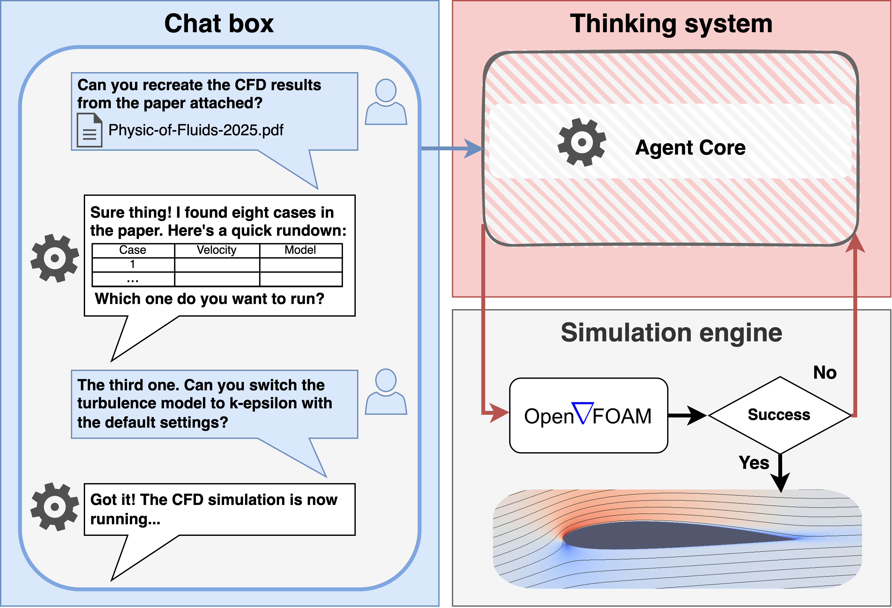

# ChatCFD: An End-to-End CFD Agent with Domain-Specific Structured Thinking

ChatCFD is a LLM-driven pipeline that automates computational fluid dynamics (CFD) workflows within the OpenFOAM framework, enabling users to configure and execute complex simulations from natural language prompts or published literature with minimal prior expertise. Further details can be found in our [arXiv](https://arxiv.org/abs/2506.02019) preprint, with a full Appendix available on [ResearchGate](https://www.researchgate.net/profile/Tianhan-Zhang-2/publication/392371234_ChatCFD_an_End-to-End_CFD_Agent_with_Domain-specific_Structured_Thinking/links/683fce526b5a287c30491773/ChatCFD-an-End-to-End-CFD-Agent-with-Domain-specific-Structured-Thinking.pdf). Through a conversational chat interface, users can:
- Upload and specify which CFD case from a paper they want to simulate
- Provide the corresponding mesh files for the simulation

The system automatically interprets the paper's specifications, configures the OpenFOAM case, and handles the simulation setup, making CFD more accessible to users without extensive domain expertise.



## Table of Contents
- [ChatCFD: An End-to-End CFD Agent with Domain-Specific Structured Thinking](#chatcfd-an-end-to-end-cfd-agent-with-domain-specific-structured-thinking)
  - [Table of Contents](#table-of-contents)
  - [Key Features](#key-features)
  - [System Requirements](#system-requirements)
    - [Core Requirements](#core-requirements)
    - [Python Dependencies Defined in `chatcfd_env.yml`](#python-dependencies-defined-in-chatcfd_envyml)
    - [Operating System](#operating-system)
  - [Installation](#installation)
    - [Step 1: Environment Setup](#step-1-environment-setup)
    - [Step 2: Configuration](#step-2-configuration)
    - [Step 3: Launch the Interface](#step-3-launch-the-interface)
  - [Usage](#usage)
  - [Performance](#performance)
  - [Citation](#citation)

## Key Features

- 🤖 **Interactive Multimodal Interface**: Supports PDF papers, mesh files, and natural language dialogue through a ChatGPT-like interface
- 🧠 **Intelligent Case Configuration**: Automatically configures OpenFOAM cases based on academic literature
- 🤝 **Multi-Agent Architecture**: Utilizes specialized AI agents with Retrieval-Augmented Generation (RAG)
- 🔧 **Robust Error Correction**: Implements a multi-category error correction system for enhanced simulation reliability
- 🔄 **OpenFOAM Integration**: Seamlessly works with OpenFOAM framework for CFD simulations

## System Requirements

### Core Requirements
- Python 3.11.4 or higher
- OpenFOAM v2406 installation
- CUDA-capable GPU (optional, but recommended for better performance)

### Python Dependencies Defined in `chatcfd_env.yml`
- **Machine Learning & AI**:
  - PyTorch 2.6.0
  - Transformers 4.50.3
  - Sentence-Transformers 4.0.1
  - FAISS-CPU 1.7.4 (for vector similarity search)
  - Scikit-learn 1.6.1
  - NumPy 1.26.4
  - Pandas 2.2.3

- **Web & API**:
  - Streamlit 1.41.1 (for web interface)
  - OpenAI 1.39.0
  - LangChain 0.1.19
  - FastAPI and related dependencies

- **PDF Processing**:
  - PDFPlumber 0.11.5
  - PyPDF2 3.0.1
  - PDFMiner.six 20231228

- **OpenFOAM Integration**:
  - PyFoam 2023.7

### Operating System
- Linux (recommended for OpenFOAM compatibility)
- Windows with WSL2 (Windows Subsystem for Linux)

## Installation

### Step 1: Environment Setup

1. Create the conda environment:
```bash
conda env create -f chatcfd_env.yml
```

2. Activate the environment:
```bash
conda activate chatcfd
```

3. Verify key components:
```bash
# Test FAISS installation
python -c "import faiss; print(faiss.IndexFlatL2(10))"

# Test PyFoam installation
python -c "from PyFoam.RunDictionary.ParsedParameterFile import ParsedParameterFile; print('PyFoam OK')"
```

4. Download and verify `SentenceTransformer`:
```bash
# Download the model
python test_env/download_model.py

# Test the model
python test_env/test_all_mpnet_base_v2.py
```

Expected output (CPU):
```
GPU Available: False
GPU Name: None
Similarity 0-1: 0.383
Similarity 0-2: 0.182
```

Note: Results will differ if using GPU.

### Step 2: Configuration

Configure the system by editing `inputs/chatcfd_config.json`:
   - Set your API keys, urls, and model names for `DeepSeek` models
   - Configure OpenFOAM paths
   - Adjust other parameters as needed

### Step 3: Launch the Interface

Start the ChatCFD interface:
```bash
streamlit run src/chatbot.py
```

The interface should look similar to:


Then the user should upload the pdf file, specify the CFD case, and upload the CFD mesh file following the guidance of ChatCFD.

## Usage

1. 📄 **Upload Documents**: Start by uploading relevant academic papers in PDF format
2. 📦 **Provide Mesh**: Upload your mesh files (supported formats: OpenFOAM, Fluent)
3. 💬 **Interactive Configuration**: Use natural language to describe your simulation requirements
4. ⚙️ **Case Execution**: Let ChatCFD handle the case setup and execution
5. 🔍 **Error Handling**: The system will automatically detect and correct common errors

## Performance

ChatCFD has demonstrated:
- 📊 30-40% success rate in direct case configuration from literature
- 🎯 60-80% operational success rate for incompressible and compressible CFD cases
- 🛡️ Robust error handling and correction capabilities

## Citation

```
@misc{fan2025chatcfd,
      title={ChatCFD: an End-to-End CFD Agent with Domain-specific Structured Thinking}, 
      author={E Fan and Weizong Wang and Tianhan Zhang},
      year={2025},
      eprint={2506.02019},
      archivePrefix={arXiv},
      primaryClass={cs.CL}
}